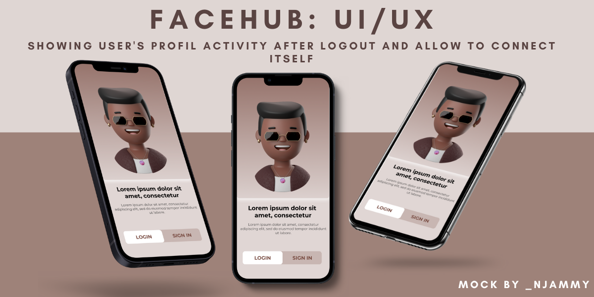
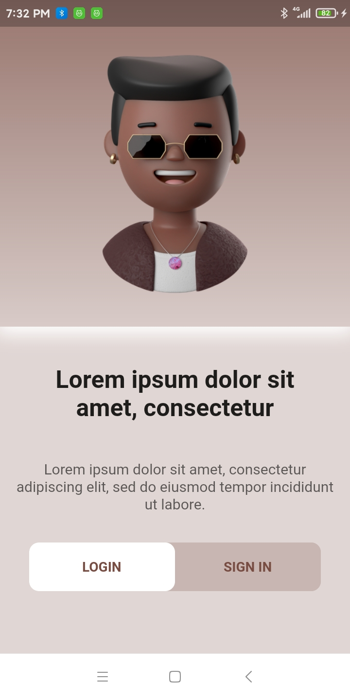

# facehub

## _Flutter interface for implement facehub concept_

## Preview

## FEATURES

- just make ui

## DEMO

## CODING SONG

- [Tems Woman No Cry](https://www.boomplay.com/songs/96904106?srModel=COPYLINK&srList=WEB)
- [No Woman No Cry (Tribute Version Originally Performed By Tems)](https://www.boomplay.com/songs/97236362?srModel=COPYLINK&srList=WEB)

## Author

- [njammy](https://github.com/njammy)

## License

- [MIT](./LICENSE)

**Free Software !**

## Note to me from the future

**Dear please Keep It Simple... :)**
